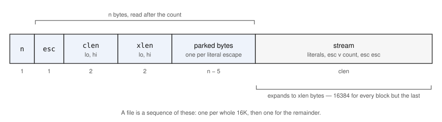
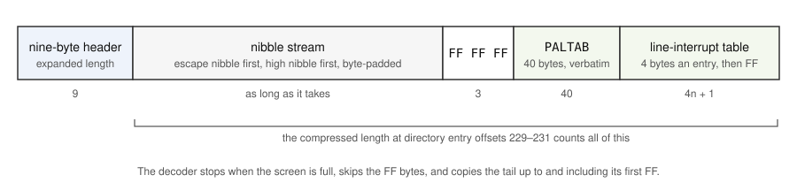

# File compression: SAVE MODE

MasterBASIC can compress SCREEN$, CODE and array files on their way to disk
and expand them again on the way back. Two different encoders do it — a
byte run-length coder that works in a spare 16K page, and a nibble
run-length coder for screens that needs no spare page — and `SAVE MODE`
chooses between them. This is what a program that wants to read or write
such files needs to know, and it is enough to reimplement either encoder.

Everything here is read out of `listings/clean/`; addresses are given so
you can check any of it. MasterBASIC's half is `MB &xxxx`, the DOS's
`DOS &xxxx`. Nothing in this document has been checked against a file
saved on a machine: see *What is not settled* at the end.

---

## The command

```
SAVE MODE 1        no compression (the default)
SAVE MODE 2        compress SCREEN$, CODE and array files, byte coder
SAVE MODE 3        as 2, but SCREEN$ files take the nibble coder
```

`CMD_SAVE` at `MB &63E6` is the `SAVE` entry of MasterBASIC's command
table, reached only with what the ROM's own `SAVE` has refused. After `BOOT`
has been ruled out it expects the `MODE` token, a number and the end of the
statement, takes the number through `BYTE_ARGUMENT`, subtracts one, and
`SET_COMPRESSION_MODE` at `MB &63F6` refuses anything that is not now 0, 1
or 2 with *Integer out of range*:

```asm
      LD C,T_MODE                     ; 63ED
      CALL CHAR_THEN_NUMBER_THEN_END  ; 63EF
      CALL BYTE_ARGUMENT              ; 63F2
      DEC A                           ; 63F5
      CP &03                          ; 63F6
      JP NC,REP_INTEGER_OUT_OF_RANGE  ; 63F8
      LD HL,DVAR_CMPFG                ; 63FB
```

The result — **the mode less one** — is written into the DOS page at
`CMPFG`, `DOS &42BA`, which is `DVAR 154`. The write goes through
`WRITE_DOS_BYTE` and the ROM's `NRWRITE` because the DOS page is not in the
window when MasterBASIC is running; that is the whole reason for the detour.

So:

| Command | `DVAR 154` |
|---|---|
| `SAVE MODE 1` | 0 |
| `SAVE MODE 2` | 1 |
| `SAVE MODE 3` | 2 |

The setting persists until it is changed, and `POKE DVAR 154,n` does the
same as the command without the range check. Because `SAVE BOOT` writes the
DOS and MasterBASIC back out with the DVAR block as it stands, a `POKE` of
154 followed by `SAVE BOOT` makes a mode the default at boot. The manual's
words for all of this are in
[masterbasic-manual.md](masterbasic-manual.md#file-compression--save-mode).

What the setting affects:

- Only `SAVE` to disk. `HOOK_HSAVE` at `DOS &64D8` hands tape and network
  saves to the ROM before it looks at `CMPFG`.
- Only file types other than BASIC. Type `&10` is turned away at
  `DOS &6504` whatever the mode.
- Nothing on `LOAD`. The load path reads the directory entry's flags, not
  `CMPFG`, so a compressed file expands whatever the current mode. Without
  MasterBASIC present the flags are ignored and the raw bytes load — the
  manual's "scrambled mess".

---

## What the directory entry records

A compressed file has two lengths: what it occupies on the disk and what
it expands to. They are kept in different places, and a program reading
the disk needs to know which it is looking at.

| Where | Holds | Written by |
|---|---|---|
| Entry offsets 11–12, sector count (high byte first) | **On-disk size**, in 510-byte sectors, the nine-byte header included | the DOS as it allocates |
| Entry offsets 211–219, the nine-byte header | **Expanded length**: bytes 212–213 the low 14 bits, 218 the page count | `SVHD`, before compression starts |
| The first nine bytes of the file's data | The same nine-byte header, so the same expanded length | `SVHD` |
| Entry offsets 239–241, ROM header bytes 34–36 | **Expanded length** in page form; what `FSTAT(f$,2)` returns | the ROM's header |
| Entry offset 220, ROM header byte 15 (`DIR_FLAGS`) | **Bit 2 set: compressed. Bit 3 set: nibble-coded screen** (bits 0 and 1 are the ROM's hidden and protected) | `HOOK_HSAVE` at `DOS &650F` and `&6529` |
| Entry offset 221, ROM header byte 16 | For a SCREEN$ file, the screen mode 0–3 | the ROM, for every SCREEN$ |
| Entry offsets 229–231, ROM header bytes 24–26 | **Compressed length**, page form, *nibble-coded screens only*: a page byte then a 16-bit offset with bit 15 set | `HOOK_HSAVE_2` at `DOS &6544` |

The manual's `FSTAT` option 8 reports offset 220 directly — "Bit 2, the
file is compressed. Bit 3, the file is a SAVE MODE 3 SCREEN$ file" — and
option 2 "gives expanded length for compressed files".

Three consequences for anyone reading a raw file out of a disk image:

1. **The file's own header lies about its length.** The nine bytes at the
   start of the data carry the expanded length; the compressed bytes that
   follow are shorter. Only the directory entry's byte 220 says which.
2. **A byte-coded file carries no compressed length anywhere.** Each block
   inside it declares its own, and the reader walks them. The sector count is
   the only whole-file figure.
3. **A nibble-coded screen does carry one**, at 229–231, and it counts
   everything after the nine-byte header: the nibble stream, the three `&FF`
   bytes that close it, and the uncompressed palette tail. `HOOK_HSAVE_2`
   takes `FPTR` — sectors times 510 plus the offset — after the compressor
   has returned, adds `&FFF7` to take the header off, and stores it through
   `PAGEFORM`.

### How the flags are set

The branch in `HOOK_HSAVE`, `DOS &64FA` onwards, after the nine-byte header
has already gone out:

```asm
      LD A,(CMPFG)                    ; 64FA  SAVE MODE less one
      AND A                           ; 64FD
      JR Z,HOOK_HSAVE_4               ; 64FE  zero: the plain save
      LD C,A                          ; 6500
      LD A,(IX+FFSA)                  ; 6501  the file type
      CP TYPE_BASIC                   ; 6504
      JR Z,HOOK_HSAVE_4               ; 6506  BASIC is never compressed
      ...
      SET 2,(HL)                      ; 650F  flags bit 2: compressed
      LD C,A                          ; 6511
      CP TYPE_SCREEN                  ; 6512
      JR NZ,HOOK_HSAVE_1              ; 6514  not a screen: byte coder
      LD A,(CMPFG)                    ; 6516
      DEC A                           ; 6519
      JR NZ,HOOK_HSAVE_2              ; 651A  SAVE MODE 3 and a screen
```

| `DVAR 154` | Type | Coder | Flags |
|---|---|---|---|
| 0 | any | none | — |
| 1 or 2 | `&10` BASIC | none | — |
| 1 | anything else | byte coder, `MB_COMPRESS_FILE` | bit 2 |
| 2 | `&14` SCREEN$ | nibble coder, `MB_COMPRESS_SCREEN_FILE` | bits 2 and 3 |
| 2 | anything else | byte coder, `MB_COMPRESS_FILE` | bit 2 |

`HOOK_HLOAD` at `DOS &6422` reads the same two bits back from `ENTRY_FLAGS`, the
copy of entry offset 220 that `COPY_HEADER_FIELDS` makes, and dispatches the
same way: bit 2 clear is a plain load, bit 2 alone is `MB_EXPAND_FILE`, bits
2 and 3 together is the screen expander at `MB &62A6` with the mode byte
from offset 221 in `A` and the compressed length from offsets 229–231.

---

## The byte coder: SAVE MODE 2, and SAVE MODE 3 for anything but a screen

`COMPRESS_FILE` at `MB &65EA` is given the file as the DOS sees it: start
address `HL` in the page in `HMPR`, whole 16K pages in `A`, remaining bytes
in `DE`, and the type in `C`. It cuts the file into **independent blocks of
16384 bytes plus one remainder**, in file order, and hands each to
`COMPRESS_BLOCK` at `MB &660A`. A remainder of zero bytes produces no block.
`EXPAND_FILE` at `MB &66D2` walks the same sequence from the expanded length
in the directory, so the reader knows how many blocks to expect without any
count in the file.

### A block on disk



- `n` — one byte, the length of what follows it before the stream: five
  plus the number of parked bytes. Written at `MB &66B6` from the low byte of
  the parked-byte pointer, which started at `&7B05`.
- `esc` — the escape byte for this block.
- `clen` — the stream's length in bytes, low byte first. At most 16384; see
  *At the edge of a block* for the case that breaks this.
- `xlen` — the block's expanded length, low byte first. 16384 for every
  block but the last; `&4000` is stored as `00 40`.
- the parked bytes, one per literal escape in the stream, in stream order.
- the stream.

The reader `EXPAND_BLOCK` at `MB &6726` takes `n`, then `n` bytes into
a buffer at `&7B00`, then `clen` bytes of stream through the DOS's
block-load entry. The parked bytes are read from `&7B05` upwards with an
eight-bit increment, so the table cannot cross `&7BFF` — and cannot need to:
the rarest of 256 values in a 16384-byte block occurs at most 64 times.

### The escape byte

A 256-entry histogram of the block is built at `&7B00` (one byte per
count, saturating at 255 through `COMPRESS_BLOCK_SATURATE`) and scanned from
value 0 upwards for the smallest count, replacing only on *strictly*
smaller. So the escape is **the least frequent byte value in the block, and
the lowest such value on a tie**. A value that does not occur at all is the
usual winner in anything but random data, and then no literal escape is ever
needed.

### The stream

Three kinds of token, decided by `COMPRESS_BLOCK_LOOP5` and what follows it
at `MB &667D`–`&66A5`:

| Input | Output | Notes |
|---|---|---|
| a run of 1 or 2 of any byte `v` not the escape | `v` or `v v` | copied literally; a run of two is not worth three bytes |
| a run of 3 to 256 of `v` | `esc v count` | `count` is the run length, with **256 written as 0** |
| the escape byte, followed by any byte `p` | `esc esc` | `p` goes to the parked-byte table instead of the stream |

Runs are counted greedily, up to 256; a longer run continues as a fresh
token. A literal escape consumes two input bytes — the escape and the byte
after it — and if that following byte is itself the escape it is parked like
any other; the decoder puts it back before looking at the next token.

The encoder works in place, output starting where input starts. That is
why the rules are shaped as they are: no case writes more than it reads (two
for two on the escape, three for three on the shortest run), so the writer
never overtakes the reader and the loop carries no bound check. The
histogram, the escape choice and the in-place loop are all in
`COMPRESS_BLOCK`, whose banner in the listing says the same at more length.

**A worked example.** Sixteen bytes:

```
41 41 41 41 41 42 43 43 44 44 44 45 45 45 45 45
```

Counts: `41`×5, `42`×1, `43`×2, `44`×3, `45`×5. The rarest is `42`, so
`esc = 42`. Encoding left to right:

```
41 41 41 41 41   run of 5        -> 42 41 05
42 43            literal escape  -> 42 42        (43 parked)
43               run of 1        -> 43
44 44 44         run of 3        -> 42 44 03
45 45 45 45 45   run of 5        -> 42 45 05
```

Stream: `42 41 05 42 42 43 42 44 03 42 45 05`, twelve bytes. One byte was
parked, so `n = 6`, and the block on disk is

```
06  42  0C 00  10 00  43   42 41 05 42 42 43 42 44 03 42 45 05
```

nineteen bytes for sixteen — the scheme only pays on data with runs, which
is what the manual says too.

### Numeric arrays are transposed first

Before the histogram, if the type in `C` is `&11` (a numeric array),
`SET_STEP_AND_COUNT` rewrites the block in 256-byte chunks. A SAM number is
five bytes, so a chunk is treated as one byte followed by 51 five-byte
elements, and `COPY_EVERY_NTH_BYTE` lays it out as that one byte, then the
first byte of each of the 51 elements, then the second byte of each, and so
on:

```
in   b0  b1 b2 b3 b4 b5  b6 b7 b8 b9 b10 ... b251 b252 b253 b254 b255
out  b0  b1 b6 b11 ... b251   b2 b7 ... b252   b3 b8 ... b253   b4 ... b254   b5 ... b255
```

Whole numbers on the SAM have their exponent byte zero and their low bytes
mostly zero, so grouping "byte 1 of every element" together turns an array
of small integers into long runs. That is the manual's "numeric arrays are
highly compressible if they are mainly filled with whole numbers".

Two details a reimplementation must copy:

- The chunks are aligned to the **end** of the block, not its start. The
  block is placed in memory so that it finishes at `&FFFF`, and
  `SET_STEP_AND_COUNT_1` rounds the start *up* to the next 256-byte boundary
  before it begins. A remainder block whose length is not a multiple of 256
  therefore leaves its first `length mod 256` bytes untransposed, and a
  block under 256 bytes is not transposed at all.
- The transpose does not know where elements begin. The array's dimension
  bytes precede its data in the file, so element boundaries fall anywhere
  relative to the chunk; the stride of five works whatever the phase.

`EXPAND_INTO_WORK_PAGE` applies the inverse (`SET_STEP_AND_COUNT_SWAPPED`,
51 bytes taken five times) after decoding, on the same end-aligned chunks.

### Decoding a block

`EXPAND_BLOCK_LOOP2` at `MB &6774`, in prose:

```
esc   = header[0]
out   = xlen bytes, written from the start
parked = header[5..n-1], read in order

while out is not full:
    b = next stream byte
    if b != esc:
        write b
    else:
        v = next stream byte
        write v                       # first copy of the run, or the escape itself
        if v == esc:
            write next parked byte    # a literal escape
        else:
            c = next stream byte      # 0 means 256
            write v another c-1 times
if type is numeric array: undo the transpose on the end-aligned 256-byte chunks
```

The decoder stops when it has produced `xlen` bytes, checked after every
write; it does not depend on where the stream ends. It too works in place,
with the stream loaded so as to end where the expanded data ends, and it is
safe for the same reason the encoder is — as long as the stream is no longer
than what it expands to.

### The work page

Both directions call `GET_WORK_PAGE` at `MB &67D7`, which asks the DOS's
`FFPG` for the largest free block of pages and takes one; if there is
none it takes the page `VMPR` names — the displayed screen — which is the
corruption the manual warns of. The block is copied to the top of that
page, so that every loop over it finishes when its pointer wraps to zero,
and copied back to its destination afterwards. None of this reaches the
disk format.

### At the edge of a block

Two loops in `COMPRESS_BLOCK` step past the last byte of the block without
looking. The block ends at `&FFFF`, and the address after it is `&0000`,
which under `CALLMB` holds ROM 0 — its first bytes are `DI` (`&F3`) and
`JP` (`&C3`). This is a reading of the instructions and has not been run;
see the last section.

- `COMPRESS_BLOCK_LOOP5` increments `HL` and then compares, so when a run
  reaches `&FFFF` the next compare is against ROM byte 0. A block whose last
  byte is `&F3` is therefore counted as one longer than it is: `.. X F3`
  becomes a run of two and is written twice, `.. X F3 F3` becomes a run of
  three and is written as `esc F3 03`.
- `COMPRESS_BLOCK_5` handles a literal escape by taking the *next* byte
  too. An escape at `&FFFF` parks ROM byte 0 and writes `esc esc`, one byte
  more than was read.

In either case the stream is one byte longer than the input consumed, and
because `COMPRESS_BLOCK_6` measures `clen` from where the output pointer
stopped, `clen` is one too many. If the block saved at least one byte
elsewhere that is absorbed: the decoder stops on `xlen` and the surplus byte
is never used. **If the block saved nothing** — no run of four or more
anywhere in it — then `clen = xlen + 1`, and the loader cannot place a
stream that is longer than its expansion: for a full 16K block
`EXPAND_BLOCK` computes a load address of `&7FFF` and the decode
starts from the wrong byte, and for a shorter block the writer runs one
byte ahead of the reader from the first token. The file would load without
an error and be wrong.

The conditions are narrow — incompressible data ending in its own rarest
byte or in `&F3` — and ordinary code, screens and arrays have runs of four
everywhere. A file of already-compressed or random data is the case that
could meet them.

---

## The nibble coder: SAVE MODE 3 screens

`COMPRESS_SCREEN_FILE` at `MB &614E` is given the screen as the ROM saved
it — the bitmap at `&8000` in the screen's page, the palette tail after it,
and the file's in-page length in `DE`, the header's `HD0B1`, which
`PICK_COMPRESSION_CONSTANTS` moves into `HL` — with the screen mode from entry offset 221 in
`A`. It needs no spare page: its output stream is built at `&E500`, above a
MODE 4 screen in the screen's own second page, and handed to the DOS in
`&1900`-byte pieces as it fills.

### The file on disk



- The nine-byte header is the ROM's, with the expanded length.
- The stream is nibbles packed **high nibble first**, its first nibble the
  escape value. If the last nibble lands in the high half of a byte the low
  half is zero and the byte is sent — except after a two-nibble count, whose
  second nibble is stored by rotating the whole `r+116` byte, so the pad is
  that count's first nibble again (8–F). Nothing reads it.
- `WRITE_THREE_FF` at `MB &6194` closes the stream with three `&FF` bytes.
- The tail is what the ROM appended to the bitmap when it built the file:
  `PALTAB`, forty bytes of palette, then the line-interrupt colour table,
  which the ROM's `FLITE` measures *up to and including its `&FF`
  terminator*. It is copied out unchanged. For a screen with no line
  interrupts it is forty palette bytes and one `&FF`.
- Entry offsets 229–231 hold the length of everything after the header.

### What is walked

`PICK_COMPRESSION_CONSTANTS` at `MB &63C5` turns the mode byte into three
numbers, and the bitmap size is the one that matters for the format:

| Mode byte | Screen | Bitmap | `V407A` | Tail, with the bitmap at `&8000` |
|---|---|---|---|---|
| 0 | MODE 1 | `&1B00` | `&33` | `&9B00` |
| 1 | MODE 2 | `&3800` | `&6D` | `&B800` |
| 2 or 3 | MODE 3 or 4 | `&6000` | `&BD` | `&E000` |

The bitmap is treated as **rows of 128 bytes** whatever the mode — 54, 112
or 192 of them — and `V407A` is three less than the row count, which is how
`NEXT_SOURCE_NIBBLE_3` tests for the end. Each byte is two nibbles, high first.

`NEXT_SOURCE_NIBBLE` at `MB &627E` defines the order the nibbles are coded in,
and it is not left to right. With `H` the row and `L` the nibble within it:

- from an even row, step to the same nibble of the row below;
- from an odd row, step back up to the row above and one nibble right;
- when the right-hand end of an odd row is reached, start the next pair of
  rows.

So the walk is `(0,0) (1,0) (0,1) (1,1) ... (0,255) (1,255) (2,0) (3,0) ...`
— every nibble followed by the one 128 bytes further on. In MODE 3 and 4,
where a row of memory is a row of pixels, that is the pixel directly below,
and vertical features become runs. In MODE 2 (32 bytes a line) 128 bytes on
is four lines down, and in MODE 1's Spectrum layout it is eight, so the
pairing means less there.

### The escape nibble

`BUILD_NIBBLE_TABLE` at `MB &6253` counts both nibbles of **24576 bytes from
the start of the bitmap**, whatever the mode — for a MODE 1 or 2 screen the
count runs on past the bitmap into whatever follows. That only affects which
value is chosen. `SCAN_NIBBLE_TABLE` then takes the least frequent of the
sixteen, the highest value on a tie — the scan runs from 15 down and
replaces only on strictly less — and `ENCODE_SCREEN` writes it as the
stream's first nibble.

### The stream

After the escape nibble, tokens. `ENCODE_RUN` at `MB &61DE`:

| Run of `v`, length `r` | Nibbles out |
|---|---|
| `v` is not the escape, `r` = 1 to 3 | `v` repeated `r` times |
| `v` is not the escape, `r` = 4 to 11 | `esc v (r-4)` |
| `v` is not the escape, `r` = 12 to 139 | `esc v hi lo` where `hi lo` is the byte `r + 116`, high nibble first — so `hi` is 8 to 15 |
| `v` is the escape, `r` = 1 to 8 | `esc esc (r-1)` |
| `v` is the escape, `r` = 9 to 136 | `esc esc hi lo` with the byte `r + 119` |

The count nibble's top bit is the discriminator: 0 to 7 is a one-nibble
count, 8 to 15 says a second nibble follows. Together they hold seven bits,
so `((hi & 7) << 4 | lo) + 12` is the run, 12 to 139, contiguous with the
short form's 4 to 11.

An escape value cannot be written literally — the decoder would take it as
a token — so every run of it, even a run of one, is escaped, and the encoder
does that by starting its counter three lower (`&88` against `&8B` at
`MB &61C5` and `&61D2`): the length it writes is the real length plus three,
and the decoder takes three off when it sees `v == esc`. The cost is three
nibbles for a lone escape, which is why the rarest value is chosen for it.

Runs are counted greedily and a longer run continues as a fresh token; the
limits of 139 and 136 are what the counter's starting values allow.

**A worked example.** Escape nibble 7, and these source nibbles in walk
order:

```
3 3 3 3 3 3   0   7   0 0   5 5 5 5 5 5 5 5 5 5 5 5 5 5
```

```
(escape)                 -> 7
3 × 6                    -> 7 3 2       (6 - 4)
0 × 1                    -> 0
7 × 1, the escape        -> 7 7 0       (1 - 1)
0 × 2                    -> 0 0
5 × 14                   -> 7 5 A       (14 - 4)
```

Thirteen nibbles, `7 7 3 2 0 7 7 0 0 0 7 5 A`, packed high-first and padded:
`77 32 07 70 00 75 A0`. A run of twenty would be `7 v 8 8`: 20 + 116 = 136 =
`&88`.

### Decoding

`EXPAND_COMPRESSED_FILE` at `MB &62E9`, in prose:

```
esc = first nibble
position = start of the walk
loop:
    a = next nibble
    if a != esc:
        put a at position; advance the walk
    else:
        v = next nibble
        c = next nibble
        if c >= 8:
            c = ((c & 7) << 4 | next nibble) + 12
        else:
            c = c + 4
        if v == esc: c = c - 3
        put v at position c times, advancing the walk each time
```

The walk stopping is the only end condition: `NEXT_SCREEN_NIBBLE_4` at
`MB &635D` resets `SP` from `V4078` and returns straight out of the expander
when the walk would enter row `V407A + 3`, the row after the last, wherever
the stream stands. Then
the tail: `FETCH_SOURCE_BYTE` skips every `&FF` it finds, copies from the
first other byte to the address after the bitmap, and stops after it has
stored an `&FF` of its own — the line-interrupt table's terminator. The
stream is refilled `&1900` bytes at a time from the compressed length at
229–231, and past the end of that the bytes come one at a time through the
DOS's `LBYT`; none of this is visible in the file.

Nothing after the walk is verified: a stream that is short leaves the rest
of the screen as it was, and one that is long is ignored.

---

## Where everything is

| Routine | Address | Does |
|---|---|---|
| `CMD_SAVE` | `MB &63E6` | parses `SAVE MODE n` and `SAVE BOOT` |
| `SET_COMPRESSION_MODE` | `MB &63F6` | range-checks and stores `DVAR 154` |
| `HOOK_HSAVE` | `DOS &64D8` | the save hook: header, branch on `CMPFG` and type, flags |
| `HOOK_HLOAD` | `DOS &6422` | the load hook: branch on flags bits 2 and 3 |
| `COMPRESS_FILE` / `COMPRESS_BLOCK` | `MB &65EA` / `&660A` | byte coder |
| `EXPAND_FILE` / `EXPAND_INTO_WORK_PAGE` / `EXPAND_BLOCK` | `MB &66D2` / `&66F2` / `&6726` | byte decoder |
| `SET_STEP_AND_COUNT` / `COPY_EVERY_NTH_BYTE` | `MB &6796` / `&67B7` | the numeric-array transpose |
| `GET_WORK_PAGE` | `MB &67D7` | a free page, or the screen |
| `COMPRESS_SCREEN_FILE` / `ENCODE_SCREEN` / `ENCODE_RUN` | `MB &614E` / `&61A0` / `&61DE` | nibble coder |
| `BUILD_NIBBLE_TABLE` / `SCAN_NIBBLE_TABLE` | `MB &6253` / `&6237` | the escape nibble |
| `NEXT_SOURCE_NIBBLE` / `NEXT_SCREEN_NIBBLE` | `MB &627E` / `&6331` | the walk, encoding and decoding |
| `EXPAND_COMPRESSED_FILE` | `MB &62E9` | nibble decoder; entered from `&62A6` |
| `PICK_COMPRESSION_CONSTANTS` | `MB &63C5` | the per-mode sizes |

The listing's own commentary on each of these — in `notes/mb-dump.txt`,
which feeds `listings/clean/masterbasic.asm` — is where the register-level
argument for every claim above lives.

---

## What is not settled

- **None of this has been run.** Every format detail is read from the
  instructions. The cheap confirmation is a disk with one file saved under
  each mode — a screen under `SAVE MODE 2` and `3`, a CODE file, a numeric
  array — and its directory sectors, which would settle the block header,
  the flags, offsets 229–231 and the tail in one go.
  [evidence-wanted.md](evidence-wanted.md) already asks for the
  directory-entry read.
- **The block-edge case** in *At the edge of a block* is a defect if the
  reading is right. [evidence-wanted.md](evidence-wanted.md) item 13 gives
  a 512-byte test for it and the predicted result. It is not in
  [bugs.md](bugs.md), because it has not been confirmed.
- **The tail copy's stop condition** assumes the first `&FF` in the palette
  tail is the line-interrupt table's terminator. Palette entries are seven-bit
  values, so that holds for the forty bytes of `PALTAB` as the ROM keeps them;
  a screen file with an `&FF` there would have its tail cut short.
